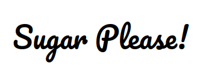

## Welcome to the documentation about "Sugar please!"

---

***Version 1 about the documentation***

> **Documentation about the project** [Link about the documentation](https://drive.google.com/file/d/1xZDkKWlGduIqi5gD8gdFt3PRdaAwC39l/view?usp=sharing)

> **Requirements about the app** [Link about the requeriments](https://drive.google.com/file/d/1qjH4-D1CziB4b7PnIOJf2SL5ud1BSLMz/view?usp=sharing)

> **App Download** [Link about the application](#)

---
***Class Responsibility Collaborator (CRC) Cards***
> **JSON for the CRC cards** [Link about the cards](jsonCRC.json)

> **PDF about the CRC cards** [Link](CRC_Maker1.pdf)

> **API where the JSON transform in CRC cards in the import button** [Link](https://echeung.me/crcmaker/)

---
***Version 2 about the documentation***

> **Documentation second edition** [Link about the documentation](revision2.pdf)

---
***Final document about the documentation***
> **Document** [Link](finalPdf.pdf)

> **App** [Link app](sugarPlease.apk)

---
